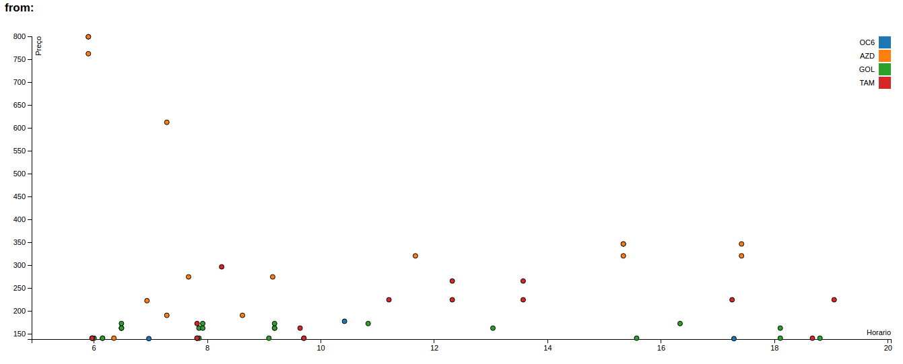
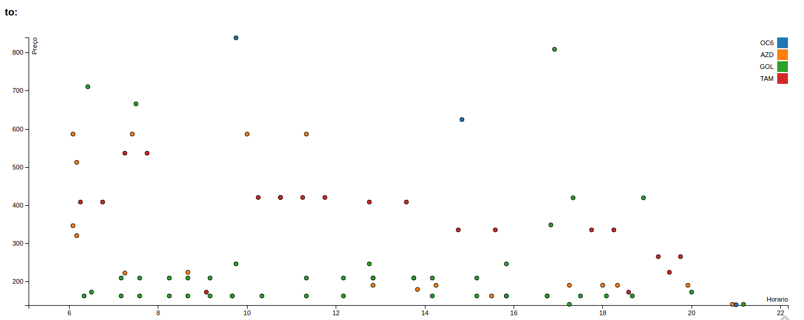

# dashboard

> This is not production ready

A simple D3 dot plot based on flights in `decolar.com`



-----



### Usage: 

```shell
$ sh startup.sh
$ firefox http://localhost:8888/${from-city}/${departure-date}/to-city/${arrival-date}/
```

##### Where:
- `from/to` are decolar codes
- `x-date` are in `yyyy-mm-dd` format

```shell
$ firefox http://localhost:8888/poa/2016-10-01/rio/2016-11-02/
```
